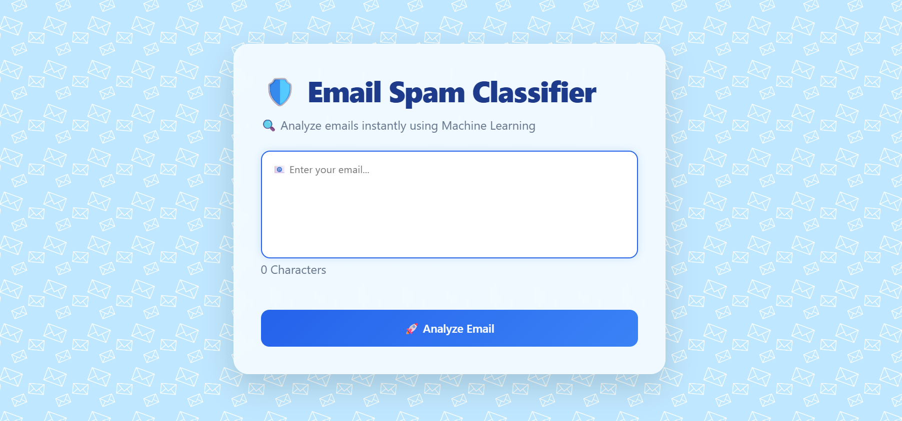
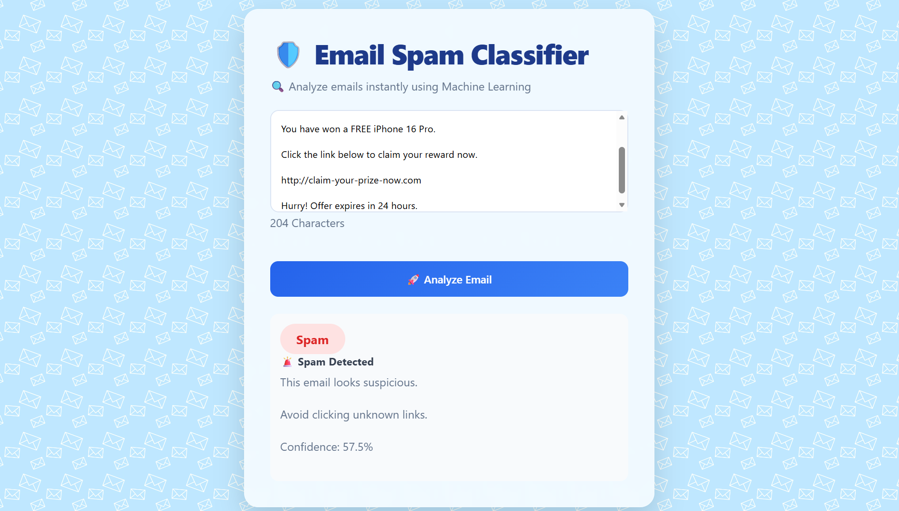
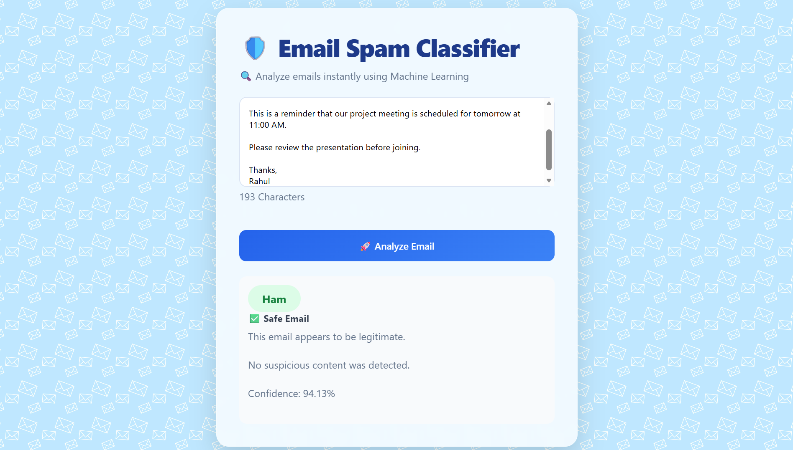

# 📧 Email Spam Classifier

A Full Stack Machine Learning project that classifies emails as **Spam** or **Safe (Ham)** using a Logistic Regression model.

---

## 🚀 Features

- 📩 Detects Spam and Safe Emails
- 🤖 Machine Learning based prediction
- ⚡ FastAPI backend for ML inference
- 🌐 Express.js backend
- 💻 React.js frontend
- 🎨 Clean and Responsive UI
- 🔄 Real-time prediction
- ⚠️ Empty input validation
- ⏳ Loading indicator while predicting

---

## 🛠️ Tech Stack

### Frontend
- React.js
- Axios
- CSS3

### Backend
- Node.js
- Express.js

### Machine Learning
- Python
- FastAPI
- Scikit-learn
- Logistic Regression
- TF-IDF Vectorizer
- Pandas
- NLTK

---

## 📂 Project Structure

```text
Email-Spam-Classifier
│
├── frontend
├── backend
├── ml_api
├── notebook
├── screenshots
└── README.md
```

---

## 🔄 Project Flow

```text
User
   │
   ▼
React Frontend
   │
   ▼
Express Backend
   │
   ▼
FastAPI
   │
   ▼
Machine Learning Model
   │
   ▼
Prediction (Spam / Ham)
```

---

## 📸 Screenshots

### 🏠 Home Page



---

### 🚨 Spam Detection



---

### ✅ Safe Email Detection



---

## ⚙️ Installation

### Clone Repository

```bash
git clone https://github.com/Pragati-jain748/Email-Spam-Classifier.git
```

### Frontend

```bash
cd frontend
npm install
npm run dev
```

### Backend

```bash
cd backend
npm install
node index.js
```

### ML API

```bash
cd ml_api
pip install -r requirements.txt
uvicorn app:app --reload
```

---

## 🎯 Future Improvements

- 📊 Confidence Score
- 📂 Email History
- 👤 User Authentication
- 📎 File Upload Support
- 🌙 Dark Mode
- ☁️ Cloud Deployment

---

## 👩‍💻 Author

**Pragati Jain**

🔗 GitHub: https://github.com/Pragati-jain748
